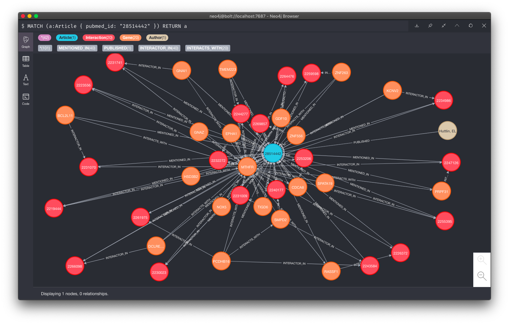

<!--
*** Thanks for checking out this README Template. If you have a suggestion that would
*** make this better, please fork the repo and create a pull request or simply open
*** an issue with the tag "enhancement".
*** Thanks again! Now go create something AMAZING! :D
***
***
***
*** To avoid retyping too much info. Do a search and replace for the following:
*** abk7777, repo, abk7x4, gclindsey@gmail.com
-->


<!-- PROJECT SHIELDS -->
<!--
*** I'm using markdown "reference style" links for readability.
*** Reference links are enclosed in brackets [ ] instead of parentheses ( ).
*** See the bottom of this document for the declaration of the reference variables
*** for contributors-url, forks-url, etc. This is an optional, concise syntax you may use.
*** https://www.markdownguide.org/basic-syntax/#reference-style-links
-->
[![Stargazers][stars-shield]][stars-url]
[![Issues][issues-shield]][issues-url]
[![MIT License][license-shield]][license-url]
[![LinkedIn][linkedin-shield]][linkedin-url]

# Projects & Experiments

<!-- Background -->
## Overview

Links to Data Science notebooks, Data Engineering pipelines and tools to facilitate data analysis, built by me. 

<!-- ABOUT THE PROJECTS -->
## Projects

### **[bioNX](https://github.com/abk7777/bioNX)** - *Under Development*

Automated Knowledge Graph construction of protein-protein interaction networks using Python and Neo4j. A bioNX Knowledge Graph allows the linking of biological data across disparate sources including as databases, APIs, literature and websites. It can provide insight to the relationships between nodes, which can be anything from academic literature, samples, or experiments, to subjects of inquiry such as gene products, PPIs, small molecules and disease conditions. It can even catalog GPS coordinates and time series data.



### **[brazil-fuel-price-analysis](https://github.com/abk7777/brazil-fuel-price-analysis)**

Data science notebooks containing EDA and geospatial analyses in the form of choropleth maps that visualize fuel price data from the Agência Nacional do Petróleo, Gás Natural e Biocombustíveis in Brazil. Uses pandas, geopandas, matplotlib, seaborn, and shapely.


### **[csv2ddb](https://github.com/abk7777/csv2ddb)**

Command line tool for easy loading of CSV files directly into AWS DynamoDB. Solves the problem of how to get your csv data into a DynamoDB table. Built on boto3 and click.

```bash
csv2ddb create --table-name my-cool-table --partition-key userId --partition-key-type N
csv2ddb load --table-name my-cool-table ./data/profile.csv
```

### **[dict-smasher](https://github.com/abk7777/dict-smasher)**

Python library using recursive functions to flatten nested dictionaries and lists of dictionaries. A work in progress. Built on Python standard library.

```python
from dict_smasher import dict_smasher, dict_write, select_keys

dict_smasher(nested_dict) # flattens dictionary
select_keys(nested_dict, keys) # select specific keys
dict_write(nested_dict, header, path) # output csv file
```

### **[iris-machine-learning](https://github.com/abk7777/iris-machine-learning/blob/master/Iris_dataset.ipynb)**

Jupyter notebook that demos EDA, cluster analysis and prediction on the Iris dataset. Uses pandas, matplotlib, seaborn, scikit-learn, and keras for simple visualization and modeling. 


### **[neo4j-titanic](https://github.com/abk7777/neo4j-titanic)**

Simple Python data pipeline that loads the *RMS Titanic* dataset into a Neo4j Docker instance. Get it up and running using `make graph`. Built using Conda, Python, Shell, Make, Neo4j and Docker.


### **[permits-data](https://github.com/abk7777/permits-data)**

Python ETL pipeline to load construction permits data from the Los Angeles Open Data Portal into a PostgreSQL Docker instance. Run `make data` to download data, load it into a Docker PostgreSQL database, transform columns and geocode missing addresses. Includes a basic Object-Relational Mapper (ORM) library for PostgreSQL using psycopg2. Built on Conda, Python, Shell, Make, PostgreSQL, Docker and psycopg2.

<!-- CONTACT -->
## Contact

Gregory Lindsey - [@abk7x4](https://twitter.com/abk7x4) - gclindsey@gmail.com

Project Link: [https://github.com/abk7777/project-portfolio](https://github.com/abk7777/project-portfolio)

<!-- CONTRIBUTING -->
## Contributing

Contributions to these projects are always welcome. Here are the basic steps:

1. Fork the Project
2. Create your Feature Branch (`git checkout -b feature/AmazingFeature`)
3. Commit your Changes (`git commit -m 'Add some AmazingFeature'`)
4. Push to the Branch (`git push origin feature/AmazingFeature`)
5. Open a Pull Request

<!-- LICENSE -->
## License

All of these projects are distributed under the MIT License. See the `LICENSE` file in each repo for more information.

<!-- MARKDOWN LINKS & IMAGES -->
<!-- https://www.markdownguide.org/basic-syntax/#reference-style-links -->

[stars-shield]: https://img.shields.io/github/stars/abk7777/project-portfolio.svg?style=flat-square
[stars-url]: https://github.com/abk7777/project-portfolio/stargazers
[issues-shield]: https://img.shields.io/github/issues/abk7777/project-portfolio.svg?style=flat-square
[issues-url]: https://github.com/abk7777/project-portfolio/issues
[license-shield]: https://img.shields.io/github/license/abk7777/project-portfolio.svg?style=flat-square
[license-url]: https://github.com/abk7777/project-portfolio/blob/master/LICENSE.txt
[linkedin-shield]: https://img.shields.io/badge/-LinkedIn-black.svg?style=flat-square&logo=linkedin&colorB=555
[linkedin-url]: https://linkedin.com/in/gregory-lindsey/
